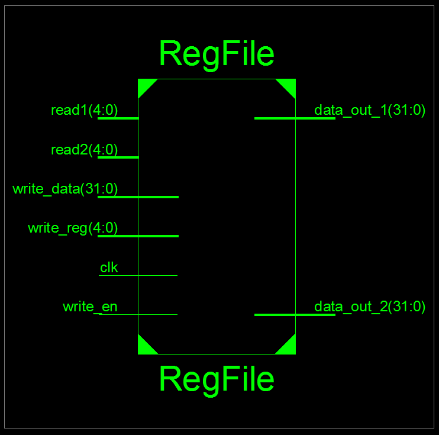
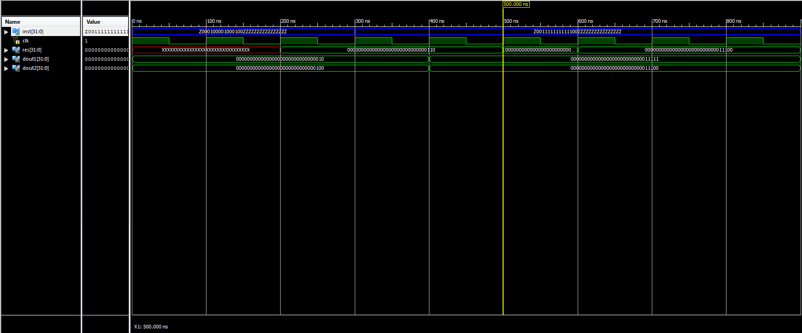

# ALU & Register File

## About
Simplified MIPS datapath consisting of a 32x32-bit register file and an ALU with seven operations. The module takes a single 32-bit R-format MIPS instruction as its input and then assigns the bits to relevant inputs.

## Modules
### Data Path
The datapath is implemented in Verilog using structural modeling. The top module combines the two smaller modules – RegFile and ALU. Bit #30 of the input instruction determines the read/write operation (0: read, 1: write). There is a two cycle delay between input and output for the datapath.

### Register File
The register file consists of thirty-two 32-bit registers. In a single clock cycle, one the following operations can be done –
* Read contents of two registers by providing the addresses of both.
* Write to a single register. Output bus #1 outputs the data loaded into this register.

To provide some values for testing and debugging, all registers are initially assigned the same value as their address number. For example, reg[10] would contain the value 00000000000000000000000000001010 and reg[31] would contain the value 11111111111111111111111111111111.

  

### Arithmetic & Logic Unit (ALU)
The ALU receives both of its inputs from the register file and the opcode from instruction[29:26]. The output of the operation is sent back to the register file. The following table lists the operations that can be performed by the ALU. 

| Op Code | Operation |
|---------|--------|
| 0000    | Input1 <b>AND</b> Input2 |
| 0001    | Input1 <b>OR</b> Input2  |
| 0010    | Input1 <b>+</b> Input2   |
| 0110    | Input1 <b>-</b> Input2   |
| 0111    | (Input1>Input2) ? Input2 : Input1 |
| 1100    | Input1 <b>NOR</b> Input2 |
| 1101    | Input1 <b>NAND</b> Input2|

  

## Simulation Waveforms

  

